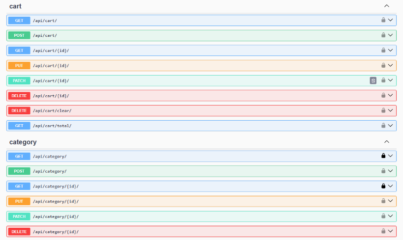
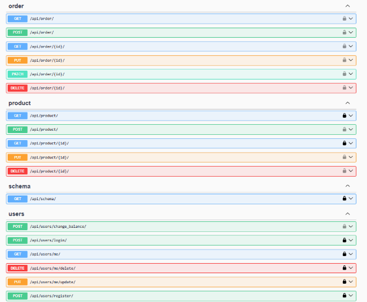
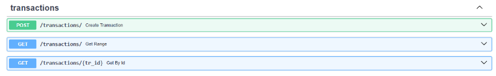

# Интернет-магазин

## О проекте
Микросервисное backend-приложение, которое реализует ключевой 
функционал интернет-магазина:
* Управление продуктами и категориями
* Оформление заказа
* Оплата
* Написание отзывов
* Уведомления

## Архитектура
├── django_backend/ # Django (основной сервис: товары, корзина, заказы + авторизация)  
│ ├── store/ # Приложение магазина  
│ ├── users/ # Пользователи Django  
│ └── config/ # Настройки Django  
├── review_service/ # Flask (сервис отзывов)  
├── transaction_service/ # FastAPI (управляет транзакциями)  
├── shared/ # Общие настройки и утилиты  

## Запуск проекта
1. Скопируйте `shared/.env.example` в `shared/.env`
2. При необходимости отредактируйте переменные в `.env` (порты, ключи, БД)
3. Примените миграции  
   `cd django_backend`  
   `python manage.py migrate`
4. Запустите каждый сервис по очереди (через PyCharm -> run -> current file)
    - **Django**  
      открыть файл django_backend/manage.py -> run -> current file
    - **FastAPI**   
      открыть transaction_service/main -> run -> current file
    - **Flask**  
        открыть review_service/main -> run -> current file

## OpenAPI Documentation
### Django

### FastAPI

